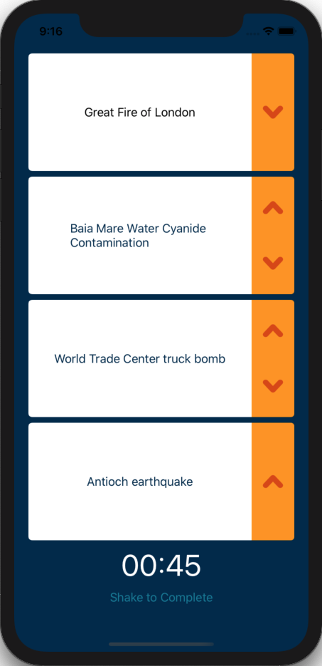
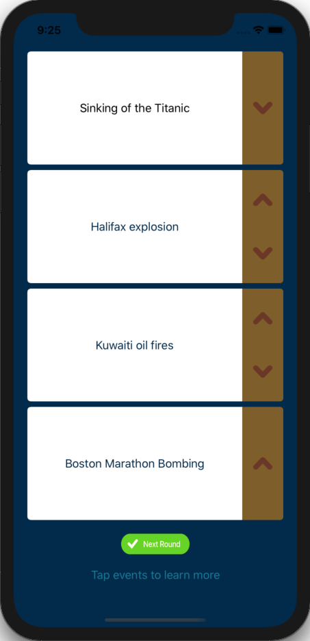

# Team Treehouse TechDegree Project 3

## 'Bout Time

**App Description:**  Quiz/Game.  User attempts to place 4 random historical events in correct chronological order across 6 rounds; device shake for next round, count down timer and final score display; link & segue to web page to display event information.

**Swift Features Used:**
Autolayout, Delegation, MVC, Enumerations, Singletons, Custom Types, AVAudioPlayer 

**Screenshots:**

